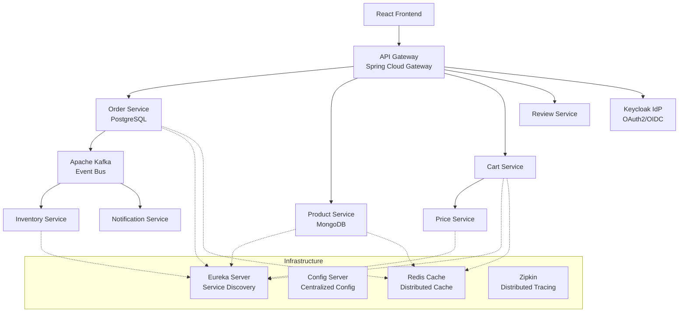

# ShopScale Fabric Platform Design

## Overview

ShopScale Fabric is architected as a cloud-native, event-driven microservices platform optimized for extreme scalability and resilience. The design follows the "Golden Triangle" approach: Spring Boot backend + Modern JavaScript frontend + Cloud-Native Infrastructure, with event-driven communication as the backbone for asynchronous, fault-tolerant operations.

## Architecture

### High-Level Architecture



### Service Communication Patterns

1. **Synchronous Communication**: Client → API Gateway → Microservices (for immediate responses)
2. **Asynchronous Communication**: Service → Kafka → Service (for event-driven workflows)
3. **Service Discovery**: All services register with Eureka for dynamic discovery
4. **Circuit Breaker Pattern**: Resilience4j protects inter-service calls

## Components and Interfaces

### API Gateway (Spring Cloud Gateway)

**Responsibilities:**
- Single entry point for all client requests
- JWT token validation and authentication
- Rate limiting (100 requests/minute/IP)
- Request routing to appropriate microservices
- Cross-cutting concerns (logging, monitoring)

**Key Interfaces:**
```java
@RestController
public class GatewayController {
    // Route definitions handled by Spring Cloud Gateway configuration
}

@Component
public class JwtAuthenticationFilter implements GlobalFilter {
    public Mono<Void> filter(ServerWebExchange exchange, GatewayFilterChain chain);
}

@Component
public class RateLimitingFilter implements GlobalFilter {
    public Mono<Void> filter(ServerWebExchange exchange, GatewayFilterChain chain);
}
```

### Order Service

**Responsibilities:**
- Process order placement requests
- Persist order data to PostgreSQL
- Publish OrderPlacedEvent to Kafka
- Handle order status updates

**Key Interfaces:**
```java
@RestController
public class OrderController {
    @PostMapping("/orders")
    public ResponseEntity<OrderResponse> createOrder(@RequestBody CreateOrderRequest request);
    
    @GetMapping("/orders/{orderId}")
    public ResponseEntity<OrderResponse> getOrder(@PathVariable String orderId);
}

@Service
public class OrderService {
    public Order createOrder(CreateOrderRequest request);
    public void publishOrderPlacedEvent(Order order);
}

@Entity
public class Order {
    private String orderId;
    private String customerId;
    private List<OrderItem> items;
    private BigDecimal totalAmount;
    private OrderStatus status;
    private LocalDateTime createdAt;
}
```

### Product Service

**Responsibilities:**
- Manage product catalog
- Handle product queries with MongoDB
- Implement Redis caching for performance
- Support product search and filtering

**Key Interfaces:**
```java
@RestController
public class ProductController {
    @GetMapping("/products")
    public ResponseEntity<List<ProductResponse>> getProducts(@RequestParam Map<String, String> filters);
    
    @GetMapping("/products/{productId}")
    public ResponseEntity<ProductResponse> getProduct(@PathVariable String productId);
}

@Service
public class ProductService {
    public List<Product> findProducts(ProductFilter filter);
    public Product findById(String productId);
}

@Document(collection = "products")
public class Product {
    private String productId;
    private String name;
    private String description;
    private BigDecimal price;
    private String category;
    private Integer stockQuantity;
}
```

### Inventory Service

**Responsibilities:**
- Consume OrderPlacedEvent from Kafka
- Update stock levels asynchronously
- Publish InventoryUpdatedEvent
- Handle inventory reservations

**Key Interfaces:**
```java
@KafkaListener(topics = "order-placed")
@Service
public class InventoryEventHandler {
    public void handleOrderPlaced(OrderPlacedEvent event);
}

@Service
public class InventoryService {
    public void updateInventory(String productId, Integer quantity);
    public void publishInventoryUpdatedEvent(String productId, Integer newQuantity);
}

@Entity
public class InventoryItem {
    private String productId;
    private Integer availableQuantity;
    private Integer reservedQuantity;
    private LocalDateTime lastUpdated;
}
```

### Cart Service with Circuit Breaker

**Responsibilities:**
- Manage shopping cart operations
- Call Price Service with circuit breaker protection
- Handle pricing failures gracefully

**Key Interfaces:**
```java
@RestController
public class CartController {
    @PostMapping("/cart/items")
    public ResponseEntity<CartResponse> addItem(@RequestBody AddCartItemRequest request);
    
    @GetMapping("/cart/{customerId}")
    public ResponseEntity<CartResponse> getCart(@PathVariable String customerId);
}

@Service
public class CartService {
    @CircuitBreaker(name = "price-service", fallbackMethod = "fallbackGetPrice")
    @TimeLimiter(name = "price-service")
    public CompletableFuture<BigDecimal> getProductPrice(String productId);
    
    public CompletableFuture<BigDecimal> fallbackGetPrice(String productId, Exception ex);
}
```

### Notification Service

**Responsibilities:**
- Consume OrderPlacedEvent from Kafka
- Send email confirmations
- Handle notification failures with retry logic
- Log notification attempts

**Key Interfaces:**
```java
@KafkaListener(topics = "order-placed")
@Service
public class NotificationEventHandler {
    public void handleOrderPlaced(OrderPlacedEvent event);
}

@Service
public class NotificationService {
    @Retryable(value = {Exception.class}, maxAttempts = 3)
    public void sendOrderConfirmation(String email, Order order);
    
    @Recover
    public void recover(Exception ex, String email, Order order);
}
```

## Data Models

### Event Models

```java
public class OrderPlacedEvent {
    private String orderId;
    private String customerId;
    private List<OrderItem> items;
    private BigDecimal totalAmount;
    private LocalDateTime timestamp;
}

public class InventoryUpdatedEvent {
    private String productId;
    private Integer previousQuantity;
    private Integer newQuantity;
    private LocalDateTime timestamp;
}
```

### Database Schemas

**PostgreSQL (Order Service):**
```sql
CREATE TABLE orders (
    order_id VARCHAR(36) PRIMARY KEY,
    customer_id VARCHAR(36) NOT NULL,
    total_amount DECIMAL(10,2) NOT NULL,
    status VARCHAR(20) NOT NULL,
    created_at TIMESTAMP DEFAULT CURRENT_TIMESTAMP
);

CREATE TABLE order_items (
    id BIGSERIAL PRIMARY KEY,
    order_id VARCHAR(36) REFERENCES orders(order_id),
    product_id VARCHAR(36) NOT NULL,
    quantity INTEGER NOT NULL,
    unit_price DECIMAL(10,2) NOT NULL
);
```

**MongoDB (Product Service):**
```javascript
{
  "_id": "product_123",
  "name": "Premium Laptop",
  "description": "High-performance laptop for professionals",
  "price": 1299.99,
  "category": "electronics",
  "stockQuantity": 50,
  "attributes": {
    "brand": "TechCorp",
    "model": "Pro-X1",
    "specifications": {...}
  },
  "createdAt": ISODate("2024-01-01T00:00:00Z")
}
```

## Error Handling

### Circuit Breaker Configuration

```yaml
resilience4j:
  circuitbreaker:
    instances:
      price-service:
        failure-rate-threshold: 50
        wait-duration-in-open-state: 30s
        sliding-window-size: 10
        minimum-number-of-calls: 5
        permitted-number-of-calls-in-half-open-state: 3
```

### Global Exception Handling

```java
@ControllerAdvice
public class GlobalExceptionHandler {
    @ExceptionHandler(ServiceUnavailableException.class)
    public ResponseEntity<ErrorResponse> handleServiceUnavailable(ServiceUnavailableException ex);
    
    @ExceptionHandler(ValidationException.class)
    public ResponseEntity<ErrorResponse> handleValidation(ValidationException ex);
    
    @ExceptionHandler(CircuitBreakerOpenException.class)
    public ResponseEntity<ErrorResponse> handleCircuitBreakerOpen(CircuitBreakerOpenException ex);
}
```

### Kafka Error Handling

```java
@Component
public class KafkaErrorHandler implements ConsumerAwareListenerErrorHandler {
    @Override
    public Object handleError(Message<?> message, ListenerExecutionFailedException exception, Consumer<?, ?> consumer) {
        // Log error and implement dead letter queue logic
        return null;
    }
}
```

## Testing Strategy

### Unit Testing
- **Service Layer**: Mock external dependencies, test business logic
- **Repository Layer**: Use @DataJpaTest for JPA repositories, @DataMongoTest for MongoDB
- **Event Handlers**: Test Kafka consumers with embedded Kafka

### Integration Testing
- **API Testing**: Use @SpringBootTest with TestContainers for database
- **Event Flow Testing**: Test complete event-driven workflows
- **Circuit Breaker Testing**: Verify fallback mechanisms

### Contract Testing
- **API Contracts**: Use Spring Cloud Contract for service contracts
- **Event Contracts**: Define Kafka event schemas and validate compatibility

### Performance Testing
- **Load Testing**: JMeter scripts for API endpoints
- **Stress Testing**: Simulate Black Friday traffic scenarios
- **Virtual Thread Testing**: Validate high-concurrency performance

### Test Configuration

```java
@TestConfiguration
public class TestConfig {
    @Bean
    @Primary
    public KafkaTemplate<String, Object> mockKafkaTemplate() {
        return Mockito.mock(KafkaTemplate.class);
    }
    
    @Bean
    @Primary
    public RedisTemplate<String, Object> mockRedisTemplate() {
        return Mockito.mock(RedisTemplate.class);
    }
}
```

## Deployment Architecture

### Docker Compose Structure

```yaml
version: '3.8'
services:
  # Infrastructure Services
  eureka-server:
    image: shopscale/eureka-server
    ports: ["8761:8761"]
    
  config-server:
    image: shopscale/config-server
    depends_on: [eureka-server]
    
  api-gateway:
    image: shopscale/api-gateway
    ports: ["8080:8080"]
    depends_on: [eureka-server, config-server]
    
  # Data Services
  postgres:
    image: postgres:15
    environment:
      POSTGRES_DB: orderdb
      
  mongodb:
    image: mongo:7
    
  redis:
    image: redis:7-alpine
    
  kafka:
    image: confluentinc/cp-kafka:latest
    depends_on: [zookeeper]
    
  # Business Services
  order-service:
    image: shopscale/order-service
    depends_on: [postgres, kafka, eureka-server]
    
  product-service:
    image: shopscale/product-service
    depends_on: [mongodb, redis, eureka-server]
    
  inventory-service:
    image: shopscale/inventory-service
    depends_on: [kafka, eureka-server]
```

### Health Checks and Monitoring

```java
@Component
public class CustomHealthIndicator implements HealthIndicator {
    @Override
    public Health health() {
        // Check database connectivity, Kafka connectivity, etc.
        return Health.up()
            .withDetail("database", "PostgreSQL connected")
            .withDetail("kafka", "Kafka broker reachable")
            .build();
    }
}
```

## Security Considerations

### JWT Token Validation
- API Gateway validates all JWT tokens before routing
- Token introspection with Keycloak for active session validation
- Automatic token refresh handling

### Data Protection
- Database connections use SSL/TLS
- Sensitive data encrypted at rest
- PII data handling compliance (GDPR considerations)

### Network Security
- Internal service communication through private networks
- API Gateway as the only external-facing component
- Rate limiting and DDoS protection

This design provides a robust foundation for the ShopScale Fabric platform, emphasizing scalability, resilience, and maintainability while following cloud-native best practices.